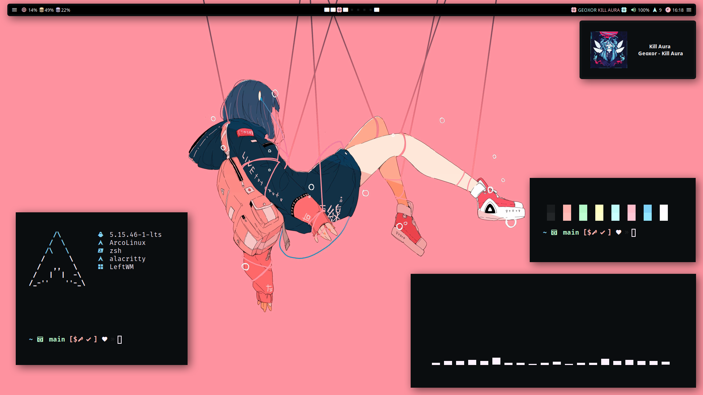

# SAGA

## Packages

```
colorscheme  : SAGA
bar          : Polybar
launcher     : Rofi
notification : Dunst
```

## Screenshot



## Dependencies

- [leftwm-git](https://github.com/leftwm/leftwm)
- [picom](https://github.com/ibhagwan/picom)
- [polybar](https://github.com/polybar/polybar)
- [rofi](https://github.com/davatorium/rofi)
- [dunst](https://github.com/dunst-project/dunst)

## Installation

1. Install all required dependencies

2. Clone the repository as SAGA

```BASH
git clone https://github.com/SAGAtheme/LeftWM.git SAGA
```

3. Move/copy the directory in your themes folder

```BASH
cp -r ./SAGA ~/.config/leftwm/themes
```

4. Remove the symlink to your current theme if set

```BASH
rm ~/.config/leftwm/themes/current
```

5. Set this as your current theme

```BASH
ln -s ~/.config/leftwm/themes/SAGA ~/.config/leftwm/themes/current
```

6. Restart your LeftWM

```Default shortcut
$MOD + Shift + r
```
